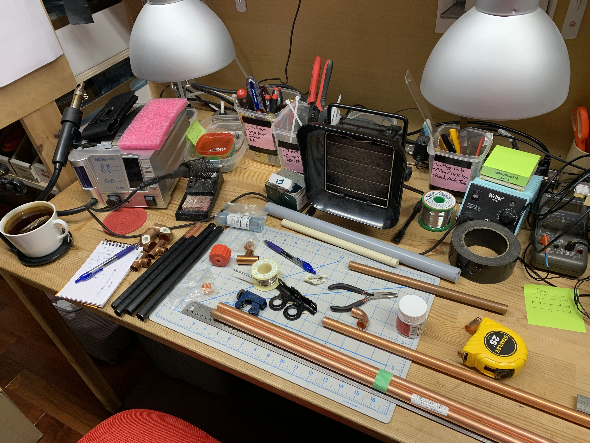
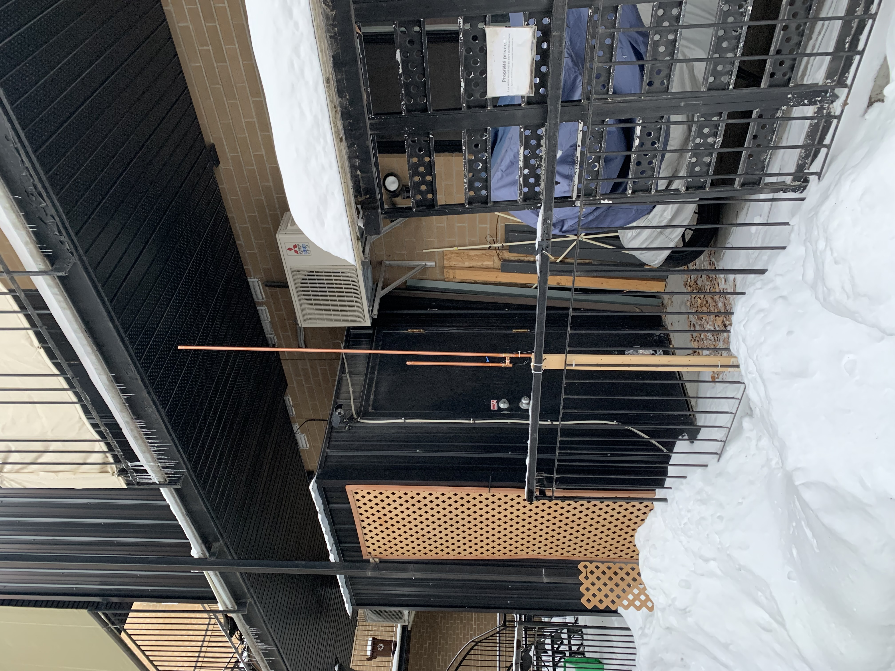
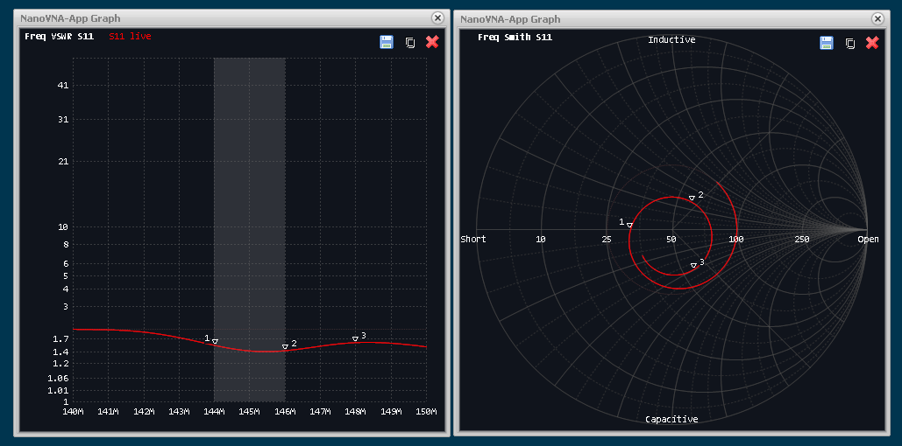
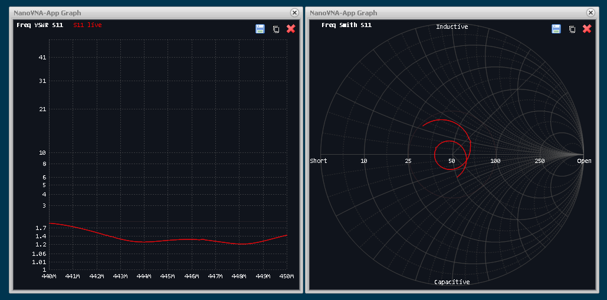
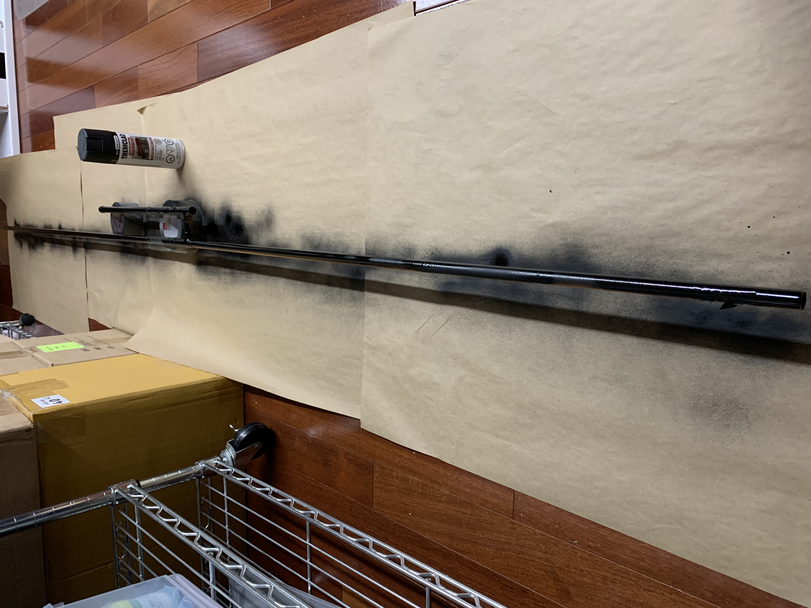

# 2m / 70cm J-Pole

After much research I concluded that the good old J-Pole was still an excellent
choice for VHF and UHF bands. Being mostly vertical it has the advantage of not
having a lot of ground radials sticking out to the sides, and also doesn't
require a large metal ground plane like a mobile antenna.

Back in the early 2000s I built a similar antenna which I used inside my second
floor workshop and it provided excellent 2m coverage. It was lost in a move at
some point, but I have always thought fondly about that antenna.

With the desire to operate on both 2m and 70cm I went looking for a design
that would cover both bands with a single antenna. Some J-Pole designs claim
to work on both bands, albeit with somewhat lower performance on 70cm. I came
across the following articles which were used as reference:

- [the SIMPLE 2m/440 Copper pipe "J"](http://bluffdaleham.yolasite.com/resources/.75%20copper%20dual%20band%20J%20pole.pdf)
- [Dual-Band Copper Pipe J-Pole: it's MAGIC!](http://km4sqs.blogspot.com/2017/10/dual-band-copper-pipe-j-pole-its-magic.html)

I worked with these designs and gathered the parts. Despite the high cost of
copper tubing I found a local hardware store with decent prices. Here are
the specs of my build:

- 1/2" copper tubing
- 63" total length (long part)
- 19" total length (matching section)

Here are the parts ready to be assembled:

I did some initial tests with the antenna on my first floor balcony. There are
too many metal objects around but I was able to get the antenna to tune up.

Here are the measurements of the VSWR made with a nanoVNA:

Finally I painted the copper to make it less conspicuous:

----
As of July 2022 the J-Pole is now installed as part of my [Home Station](../HomeStation/) with
a rebuilt feed arrangement.
