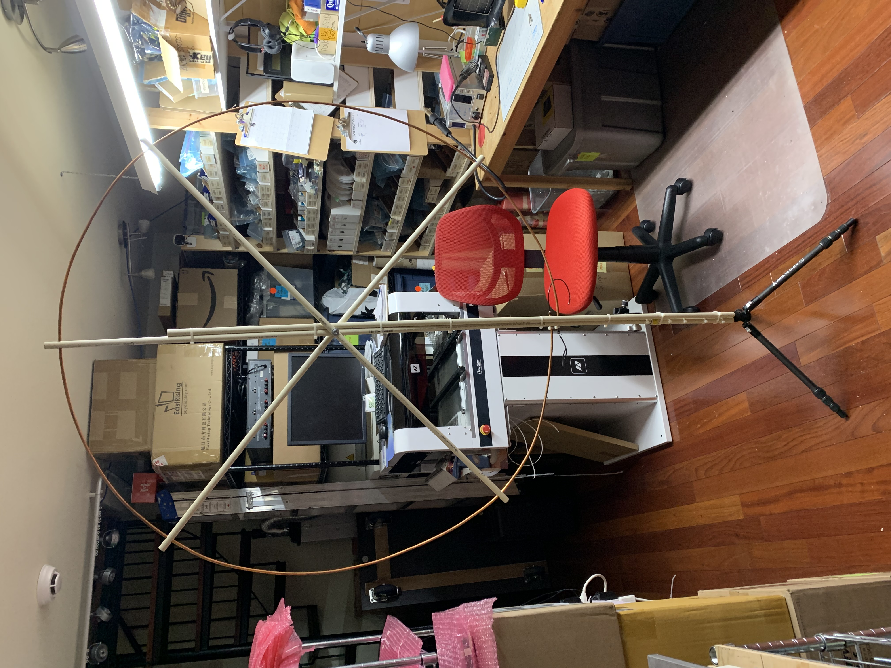

# PA0FRI Active Receiving Loop

The first antenna I made was the PA0FRI receiving loop which claims to be
relatively insensitive to noise and small compared with the wavelengths it
can be used to receive. I made this out of some thin flexible copper tubing
that was left over from some plumbing projects.

Here are the specs:
- 120cm diameter        - 47.25"
- support pipe
  - 47.25" C-C hole + 1" each end = 49.25"
  - centre hole for mounting = 24.625"
  - end holes = 47.25" / 2 = 23.625"
- performance is poor and lots of noise pickup

Here is the [schematic](docs/active_mag_loop_amp-sch.pdf) that I ended up with
based on the design from PA0FRI.

Basically this design didn't work at all and just received tons of local noise.
I kept the loop amp and bias see but just reused the rest of the materials for
other projects.
