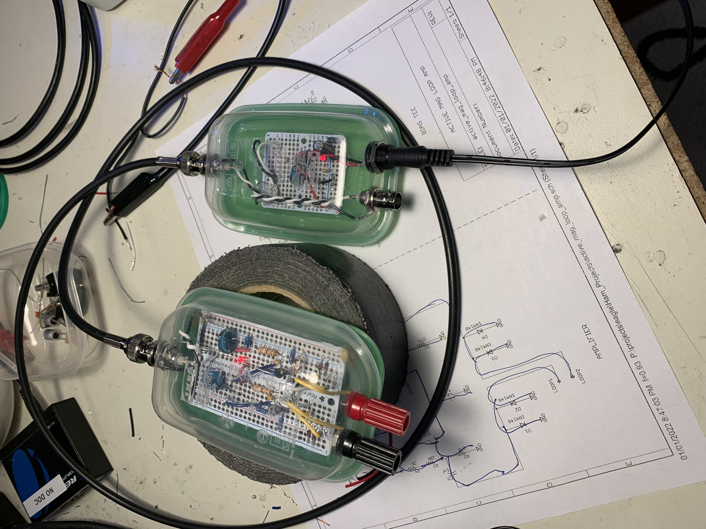

# PA0FRI Active Receiving Loop

In an effort to get into HF amateur radio and shortwave listening, I thought
it would be fun to build a receive-only antenna to start. I had come across
a lot of loop antennas designs and these always seemed to promise both small
size and low noise. Apparently loops are less susceptible to urban man-made
noise, but I have yet to fully understand why this is. (I am skeptical that
it's true)

The first project I tried was to build a version of the PA0FRI receiving loop
which uses an receiver amplifier / impedance conversion stage located at the
actual antenna. This was my first time building a bias tee and sending power
over the coax which was quite fun.

I made this antenna out of some thin flexible copper tubing that was left over
from some plumbing projects.

Here are some of my notes:
- 120cm diameter    - 47.25"
- support pipes     - 1/2" PVC water pipes
- performance is poor and lots of noise pickup

Here is the [schematic](docs/active_mag_loop_amp-sch.pdf) that I ended up with
based on the design from PA0FRI.

The amplifier and bias tee seemed to work. I ran some coax out the basement
window of my shack and put the antenna on my first floor balcony. Perhaps it
was the location, but the amount of local noise was so high that I failed to
hear even a single HF signal.

I experimented with repositioning the antenna as much as possible, but could
not get anything more than just incredible amounts of noise. I believe that
in the right environment this type of antenna probably works, but it did not
work at all in my setup.
