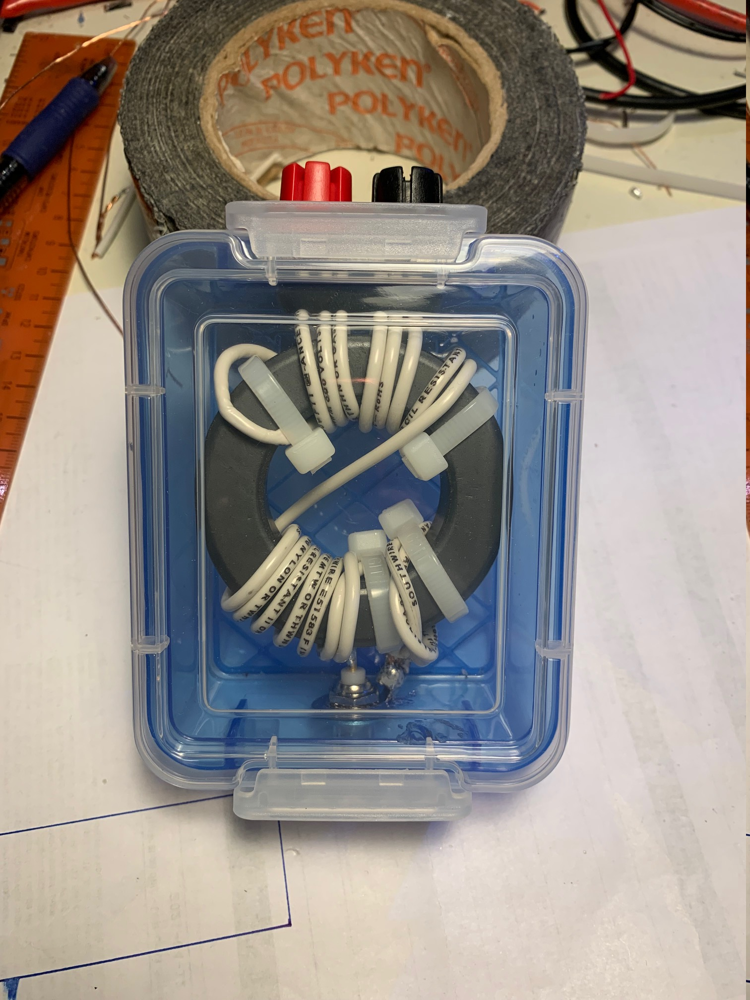
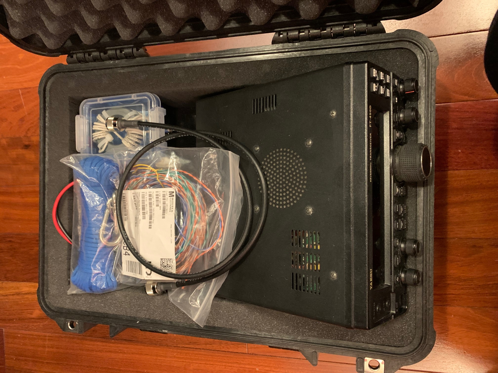
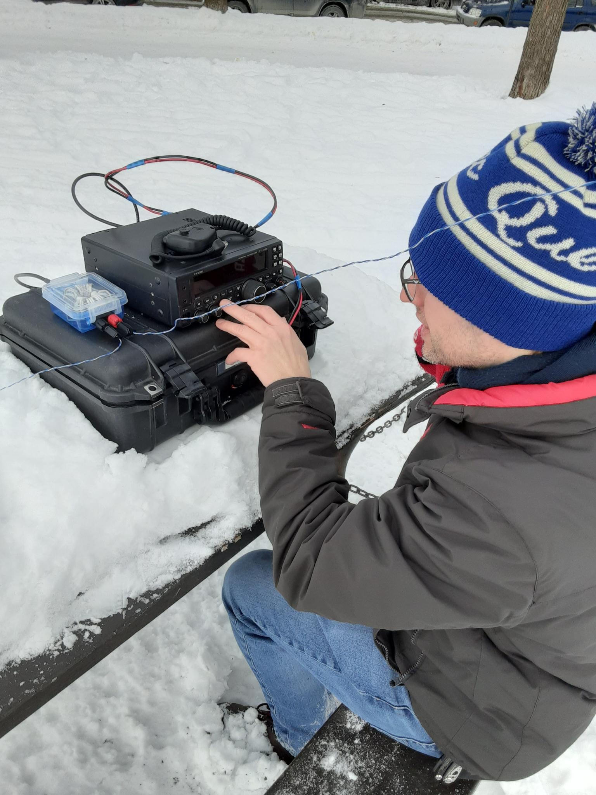
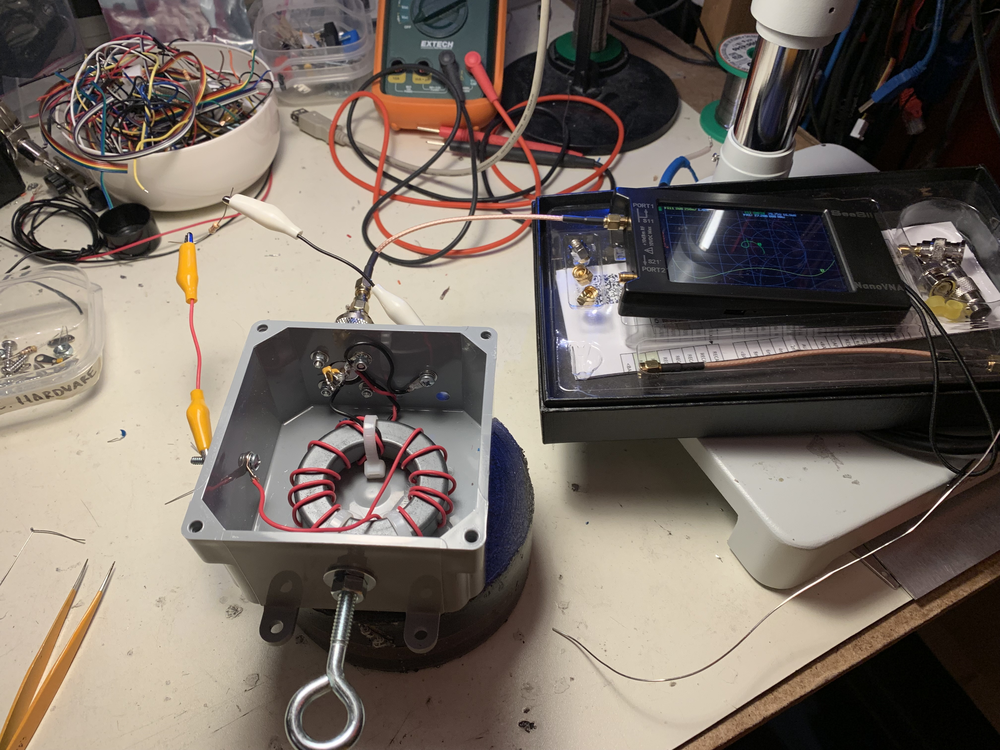
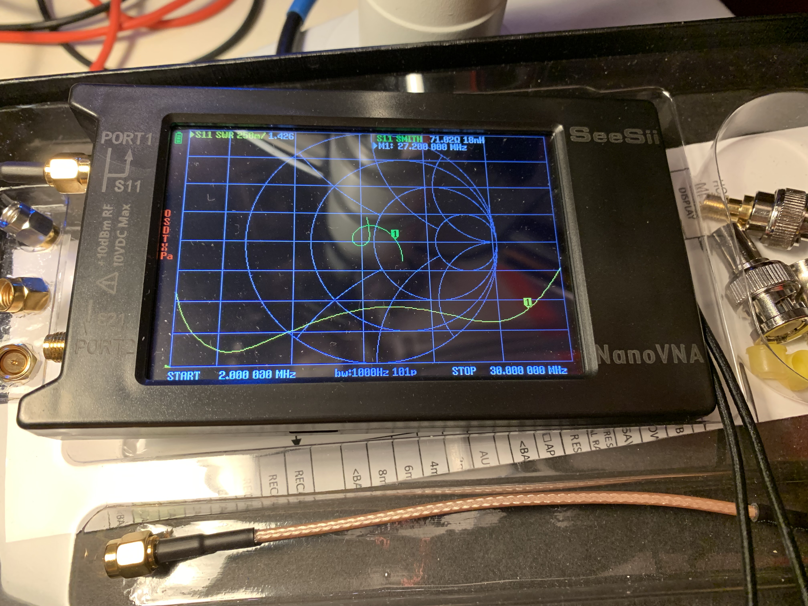
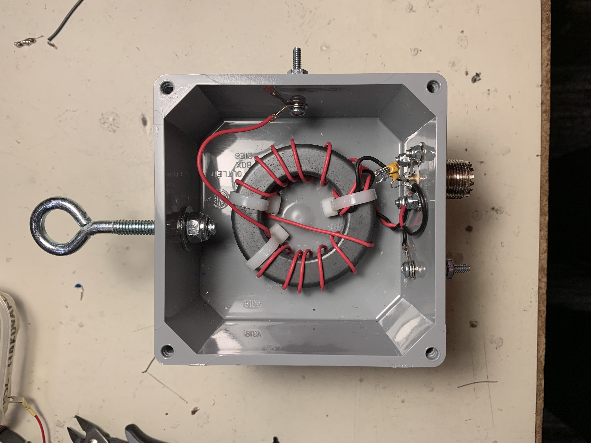

# End-Fed Half Wave Experiments

The first transmitting antenna I made for HF was an end-fed half wave for 40m
which consisted of a ~66' piece of wire made from some CAT5 cable pairs spliced
together, and a small 49:1 unun in a plastic food container.

This actually allowed me to make a contact from a park during January 2022.
(it was -14C!) I used about 20W and ran my FT-450D off a 12V SLA battery for
about 10 minutes until my hands were freezing.

I took the same setup out again in the spring with a friend but could not get
the antenna to tune up at all. I believe there was a loose connection in the
unun, but I disassembled it to reuse the ferrite.

In preparation for my home station I built a more rugged 49:1 unun  in a
weatherproof electrical box with the proper high-voltage compensation
capacitor across the feedline, and studs for permanent attachment of the
cables. I also used a high-quality SO-239 connector.

This tests out on the bench with a 2.7K load resistor but has so far not
been installed since the home antenna plans changed. I hope to use it sometime.

