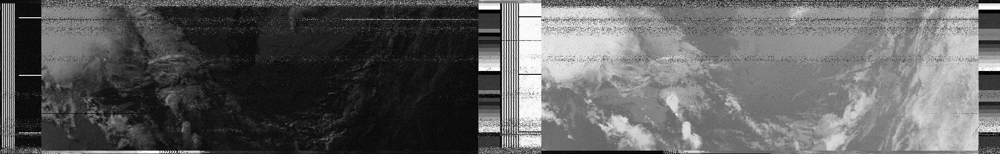

# V-Dipole for NOAA Weather Satellite Receiving

I saw a video about receiving NOAA weather satellite images and realized
that I had all the parts I needed to do this. My plan was to take my laptop
and the Airspy HF+ to the park near my house and receive some images.

The most convenient antenna design I found was the V-dipole which I figured
I could make from some telescopic antennas. This way the entire setup would
fit into my backpack.

The antenna is made from two small telescopic whips which are glued into
some pipe caps. A threaded 1/4-20 insert was used to allow the antenna to
be mounted onto a small table-top camera tripod since it is quite sensitive
to be tilted or rotated while in use. To deploy I pull out both whips
completely and then collapse one section, which I think is about the perfect
length. The gpredict software for Linux lets me know when I should go and
sit outside.

My partner and I went to the park and sat on a park bench with the antenna.
My laptop ran gqrx and was squawking away as the signal came in. Everyone who
walked by must have though we were some kind of weirdos, but we managed to
capture two passes.

## First Results

Here are some pictures we captured:

