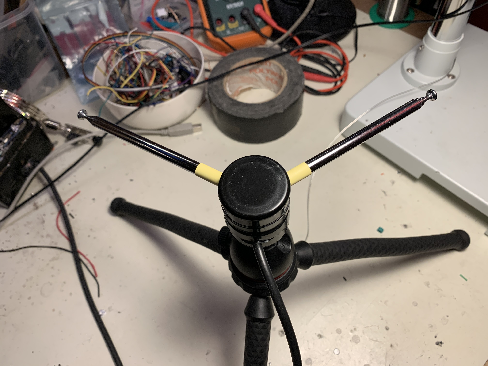

# V-Dipole for NOAA Weather Satellite Receiving

I saw a video about receiving NOAA weather satellite images and realized
that I had all the parts I needed to do this myself. My plan was to take my laptop
and the Airspy HF+ to the park near my house and receive some images.

## Basic Concept

There are currently (as of 2022) three NOAA weather satellites operated by the
US government which send analog images on the VHF band between 137MHz and 138MHz.
The transmit power is quite high so a very simple antenna can be used. Passes are
pretty fast so it is necessary to use a website or satellite prediction software
to know when/where to listen. I found that `gpredict` software for Linux was easy
to use.

To actually receive the signal an FM receiver is needed. Some people report being
able to use narrowband FM handheld radios but I found that a clean signal was received
when I opened up the receiver bandwidth to around 30-40kHz. I used an Airspy HF+ SDR
receiver connected to the `grqx` software to receive and record the signals to a
WAV file. The `noaa-apt` program was simple and easy to use for decoding and saving
the pictures as image files.

## Antenna Design

There are a number of recommended designs for listening to weather satellites.
The most convenient antenna design I found was the V-dipole which I figured
I could make from some telescopic antennas I had laying around. Essentially it
is just a dipole with the radiators arranged at an angle of about 120 degrees.

Coax just connects to the two radiators without the need for any kind of matching
system. The antenna is mounted horizontally with the radiators oriented in a
North-South direction. If the sky is free from obstructions like tall buildings
the signal can normally be heard as soon as the satellite comes over the horizon
and maintains a strong signal until it nearly reaches the other horizon.

The antenna is made from two small telescopic whips which are glued into
some pipe caps. A threaded 1/4-20 insert was used to allow the antenna to
be mounted onto a small table-top camera tripod since it is quite sensitive
to be tilted or rotated while in use. To deploy I pull out both whips
completely and then collapse one section, which is about the right length of
approx. 57cm for each side of the dipole.

## Testing

My partner and I went to the park and sat on a park bench with the antenna. In
this case he held the antenna by the tripod but we didn't have a place to set it
down. By holding the antenna still it was possible to capture a full pass, even
with nearby poles, trees, and houses.

## First Results

Here are some pictures we captured:

