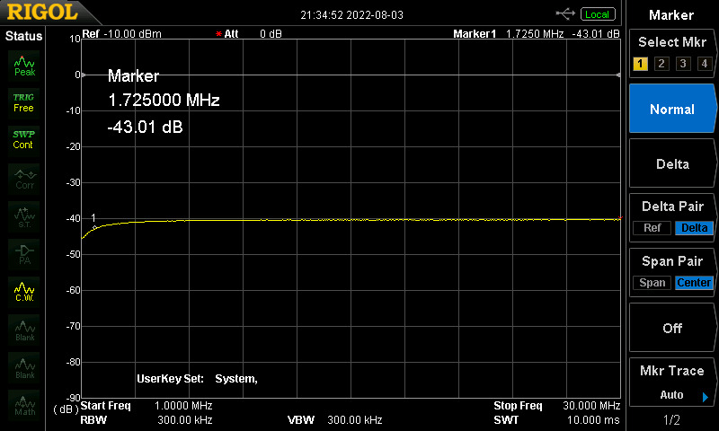

# RF Sampler 40dB / 1-220MHz

I have been experimenting with transmitters and have long wanted to be
able to measure the RF purity and bandwidth on my spectrum analyzer. A few
years ago I had the chance to attend the Dayton Hamvention with a buddy
and picked up a nice Mini-Circuits 0-2000MHz directional coupler which I
have used to good effect for sweeping antennas. But it only handles 2W
via the thru port. Clearly not even good for testing a handheld or QRP
transmitter.

After some digging I found the following resources which I used as inspiration
for my own build:

- [50dB HF RF Sampler](http://www.n4ga.com/50db-hf-rf-sampler/)
- [Build a Quality RF Power Sampler](http://www.collinsradio.org/wp-content/uploads/2015/05/Build-a-Quality-RF-Power-Sampler-Jackson.pdf)

## Design

I decided to use a tiny little Hammond 1550Q die-cast aluminum project box.
It was a bit tricky to work in such a small space but the ability to keep
the lead lengths short allowed me to make a good performing unit. The original
idea was a 1-500MHz version similar to the first link above. However as you can
see the author was not able to really get very good performance on the coupling
all the way up to 500MHz, and neither was I. A different transformer design is
probably necessary to reduce the resonance and capacitive coupling that I
believe causes the irregular performance above about 250MHz or so.

The overall design consists of a through port using a very short piece of RG8X
coax that has the shield set up as a telescoping shield with the braid cut
away on the output side. This allows transformer action to work but provides a
Faraday shield to minimize capacitive coupling to the transformer windings.

Around the coax is placed a small toroid with a number of windings. This generates
a fairly high impedance output signal which is mostly shorted out by a very low impedance
and then fed via a series resistor to the coupled port. I chose to use -40dB
coupling to effectively measure low-power transmitters. In the case of higher
power signals a series attenuator might be needed on the coupled port to protect
the spectrum analyzer.

## Experimental Process

The first thing I wanted to do was to see how flat the through response would be
without any transformer or toroid core around the through line. I made up a
simple through test in my box with a piece of centre conductor / dielectric
from the coax soldered between the IN and OUT jacks.

### Through Performance - No Toroid - Cover Installed

    <100MHz - ~-0.02dB
    145MHz - -0.25dB
    237MHz - -0.58dB
    334MHz - -0.86dB
    441MHz - -1.30dB
    500MHz - -1.31dB

 

----
### Through Performance - T50-2 Toroid - Cover Installed

Next I placed a T50-2 toroid around the cable to see how it would
affect the through performance. Not much!

    <100MHz - ~-0.06dB
    145MHz - -0.33dB
    237MHz - -0.77dB
    334MHz - -1.20dB
    441MHz - -1.80dB
    500MHz - -1.86dB

----
### Through Performance - FT91-61 Toroid - Cover Installed

Next I tried using an FT91-61 (I think that's the size) core that I
had. This is a very high performance core recommended for HF transformers
but as you can see the performance into the VHF and UHF range is poor. I
believe the permeability is too high.

    -1dB at 36MHz
    -2dB at 92MHz
    -3dB min at 225MHz
    -3.6dB min at 333MHz
    -4dB min at 430MHz
    -4dB at 500MHz

 

## Final Design

For the final design I chose to use the T50-2 toroid. A coil is wound
around the toroid with one end connected to ground, and the other end
connected to a load `Rt` to ground. The output the coupled port is taken
via `Rs` which connects to the output of the transformer.

To calculate the load (Rt) and series (Rs) resistors to give the correct
attenuation at the coupled output the following formulas are used:

    Rt = 100 * N * sqrt(Ps/Po)

    where:
      - Rt = coil terminator
      - N = number of turns   = 17 turns
      - Ps = source power     = 100W
      - Po = output power     = 10mW

    Rt = 17 ohms (18 ohms used)

    Rs = 50 - Rt = 33 ohms (33 ohms used)

Here is a picture of the final setup inside. Above about 200MHz the response
of the coupled port is highly affected by changes in the position of the transformer
leads and resistors.

 

----
## Results

The final results are below. Through performance is fairly good and definitely
usable across the useful range of the coupling port.

Here is the coupled port performance from 1-500MHz. You can see that up to around
220MHz the performance is within about 1dB. The 3dB down point is at 261MHz. Above
that a sharp dip and then some resonances seem to limit accuracy.

Another test was run from 1-30MHz which is of particular interest for HF radio projects.
The low frequency performance starts to roll off below about 4MHz, but from 4-30MHz the
performance is within about 1dB. The 3dB down point on the low end is around 1.7MHz.

Overall an interesting and educational build! I will definitely put it to good use
in my future experiments!
